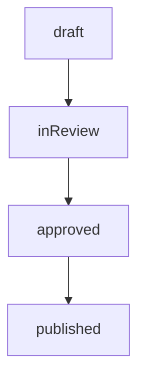

# 📚 Dokumentations-Zusammenfassung

> Übersicht aller erstellten Dokumentationen für das Quantiva CMS

---

## ✅ Erstellte Dateien

### 📁 Dokumentation (`/docs`)

| Datei | Beschreibung | Zeilen |
|-------|--------------|--------|
| **[docs/README.md](./docs/README.md)** | Dokumentations-Übersicht & Schnellstart | ~100 |
| **[docs/cms-workflow.md](./docs/cms-workflow.md)** | Vollständige Workflow-Dokumentation | ~1000+ |
| **[docs/GIT_SETUP.md](./docs/GIT_SETUP.md)** | Git Setup & Commit-Anleitung | ~300 |

### ⚛️ React-Komponenten

| Datei | Beschreibung | Zeilen |
|-------|--------------|--------|
| **[src/admin/components/WorkflowDiagram.tsx](./src/admin/components/WorkflowDiagram.tsx)** | Interaktives Workflow-Diagramm | ~200 |

### 📄 Root-Dokumentation

| Datei | Beschreibung | Zeilen |
|-------|--------------|--------|
| **[WORKFLOW_DOCUMENTATION.md](./WORKFLOW_DOCUMENTATION.md)** | Workflow-Dokumentation (Backup) | ~500 |
| **[DOCUMENTATION_SUMMARY.md](./DOCUMENTATION_SUMMARY.md)** | Diese Datei | - |

---

## 📊 Inhalt der Dokumentation

### 1. CMS Workflow (`docs/cms-workflow.md`)

**Vollständige Workflow-Dokumentation mit:**

✅ **Übersicht**
- 5 Status-Stufen (draft, inReview, approved, rejected, published)
- 5 Rollen (Admin, Editor, Reviewer, Publisher, Viewer)

✅ **Mermaid-Diagramm**


✅ **Berechtigungs-Matrix**
- Detaillierte Tabelle aller Rollen & Aktionen
- Wer kann was und wann

✅ **Technische Referenz**
- TypeScript-Typen
- Code-Beispiele
- Berechtigungsprüfung
- Status-Übergänge

✅ **Best Practices**
- Workflow-Disziplin
- Rollen-Trennung
- Qualitätssicherung
- Kommunikation

✅ **Erweiterungen**
- Automatische Reviewer-Zuweisung
- Audit-Log
- Publish-Hooks & Webhooks
- Draft-Preview-Links

✅ **FAQ**
- 15+ häufig gestellte Fragen
- Allgemeine & technische Fragen
- Workflow-Fragen

---

### 2. Workflow-Diagramm-Komponente

**React-Komponente für interaktive Anzeige:**

```tsx
import WorkflowDiagram from './admin/components/WorkflowDiagram';

<WorkflowDiagram />
```

**Features:**
- ✅ Visueller Status-Flow mit Icons
- ✅ Farbcodierte Status-Badges
- ✅ Rollen-Matrix als Tabelle
- ✅ Hinweis-Box mit Best Practices
- ✅ Dark Mode Support
- ✅ Responsive Design

---

### 3. Git Setup Guide

**Anleitung zum Committen:**

- Git-Repository initialisieren
- Dokumentation committen
- SSH-Key Setup
- Branch-Strategie
- Commit-Konventionen
- Troubleshooting

---

## 🚀 Nächste Schritte

### 1. Dokumentation ins Repository committen

```bash
cd /Users/herijeanmasum/Developer/quantiva-website

# Git initialisieren (falls noch nicht geschehen)
git init
git remote add origin https://github.com/quantiva/quantiva-website.git

# Dokumentation committen
git add docs/
git add WORKFLOW_DOCUMENTATION.md
git add src/admin/components/WorkflowDiagram.tsx
git add DOCUMENTATION_SUMMARY.md

git commit -m "docs: Add comprehensive CMS workflow documentation

- Add workflow diagram with Mermaid
- Add role-based permissions matrix
- Add technical reference and code examples
- Add FAQ and best practices
- Add WorkflowDiagram React component
- Add interactive workflow viewer in Admin Dashboard
- Add Git setup guide"

git push -u origin main
```

### 2. GitHub-Features nutzen

**Mermaid-Diagramme:**
- Werden automatisch in GitHub gerendert
- Interaktiv und klickbar
- Perfekt für Dokumentation

**GitHub Pages (optional):**
```bash
# Dokumentation als Website veröffentlichen
git checkout -b gh-pages
git push origin gh-pages
```

Dann in GitHub: Settings → Pages → Source: `gh-pages`

### 3. Team informieren

**E-Mail/Slack:**
```
🎉 Neue CMS-Dokumentation verfügbar!

Wir haben eine umfassende Dokumentation für unser CMS-Workflow-System erstellt:

📚 Dokumentation: /docs/cms-workflow.md
🔀 Workflow-Diagramm: Im Admin Dashboard unter "Workflow"
🔗 GitHub: [Link zum Repository]

Die Dokumentation enthält:
✅ Vollständiges Workflow-Diagramm
✅ Rollen & Berechtigungen
✅ Best Practices
✅ Code-Beispiele
✅ FAQ

Bitte lest die Dokumentation durch und gebt Feedback!
```

---

## 📈 Statistiken

### Dokumentations-Umfang

| Kategorie | Anzahl |
|-----------|--------|
| **Markdown-Dateien** | 4 |
| **React-Komponenten** | 1 |
| **Gesamt-Zeilen** | ~2000+ |
| **Mermaid-Diagramme** | 1 |
| **Code-Beispiele** | 20+ |
| **FAQ-Einträge** | 15+ |

### Abgedeckte Themen

- ✅ Workflow-System
- ✅ Rollen & Berechtigungen
- ✅ Status-Übergänge
- ✅ Berechtigungsprüfung
- ✅ Best Practices
- ✅ Code-Beispiele
- ✅ Erweiterungen
- ✅ FAQ
- ✅ Git Setup
- ✅ Troubleshooting

---

## 🎯 Roadmap

### Geplante Dokumentation

- [ ] **API-Dokumentation**
  - REST Endpoints
  - Authentication
  - Rate Limiting
  - Webhooks

- [ ] **Komponenten-Bibliothek**
  - UI-Komponenten
  - Props & Events
  - Styling-Guide
  - Accessibility

- [ ] **Deployment-Guide**
  - Vercel Deployment
  - Environment Variables
  - CI/CD Pipeline
  - Monitoring

- [ ] **Entwickler-Handbuch**
  - Setup & Installation
  - Development Workflow
  - Testing-Strategie
  - Code-Standards

- [ ] **User-Guide**
  - Admin Dashboard Tutorial
  - Content-Erstellung
  - Workflow-Nutzung
  - Tipps & Tricks

---

## 📞 Support

### Dokumentation
- **Workflow**: [docs/cms-workflow.md](./docs/cms-workflow.md)
- **Git Setup**: [docs/GIT_SETUP.md](./docs/GIT_SETUP.md)
- **README**: [docs/README.md](./docs/README.md)

### Kontakt
- **E-Mail**: support@quantiva.com
- **Admin**: admin@quantiva.com
- **GitHub**: [Issues](https://github.com/quantiva/quantiva-website/issues)

---

## 🎉 Zusammenfassung

**Was wurde erstellt:**

1. ✅ **Vollständige Workflow-Dokumentation** (~1000+ Zeilen)
   - Mermaid-Diagramm
   - Rollen-Matrix
   - Technische Referenz
   - Best Practices
   - FAQ

2. ✅ **Interaktive React-Komponente** (~200 Zeilen)
   - Workflow-Diagramm
   - Rollen-Matrix
   - Status-Badges
   - Dark Mode Support

3. ✅ **Git Setup Guide** (~300 Zeilen)
   - Repository Setup
   - Commit-Konventionen
   - Branch-Strategie
   - Troubleshooting

4. ✅ **Dokumentations-Struktur**
   - README
   - Übersichten
   - Verlinkungen

**Alles ist bereit für:**
- ✅ Git Commit
- ✅ GitHub Push
- ✅ Team-Sharing
- ✅ Production Use

---

*Erstellt: Oktober 2025*  
*Version: 1.0.0*  
*Status: Ready for Production* 🚀

