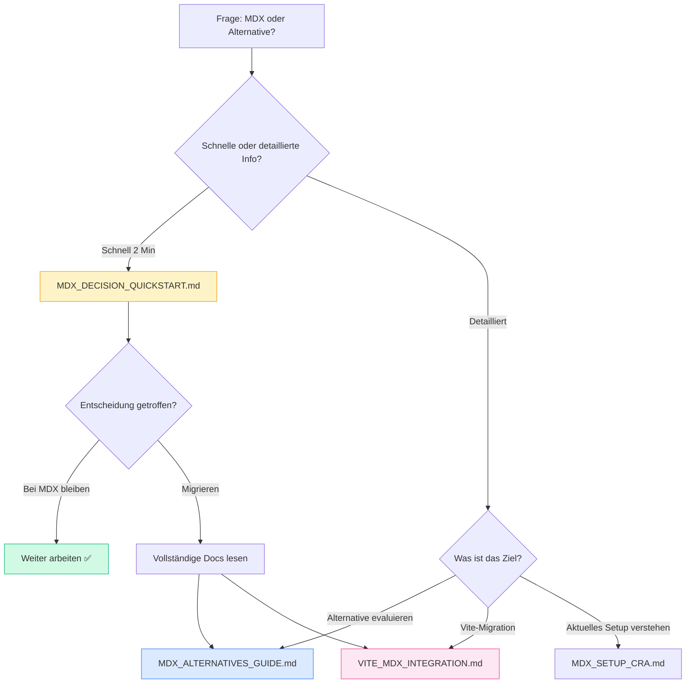

# Dokumentations-Update: MDX & Vite

> Zusammenfassung aller neuen Dokumentationen zu MDX-Alternativen und Vite-Integration

**Datum:** Oktober 2025  
**Kontext:** Umfassende Dokumentation zu MDX, Vite und Alternativen

---

## 📋 Was wurde erstellt?

### 1. Neue Dokumentationen

#### ⚡ MDX_DECISION_QUICKSTART.md
**Zweck:** 2-Minuten-Entscheidungshilfe  
**Zielgruppe:** Alle Entwickler  
**Inhalt:**
- Schnellcheck: Bleiben oder wechseln?
- Vergleichstabelle auf einen Blick
- Nächste Schritte je nach Situation
- Links zur vollständigen Dokumentation

**Wann lesen?** Wenn Sie sich fragen: "Soll ich bei MDX bleiben?"

---

#### 📚 MDX_ALTERNATIVES_GUIDE.md
**Zweck:** Vollständige Analyse aller Alternativen  
**Zielgruppe:** Entwickler, die eine Migration planen  
**Inhalt:**
- Detaillierte Beschreibung: Markdoc, Astro, Contentlayer, Markdown
- Code-Beispiele für jede Alternative
- Vor- und Nachteile
- Migration-Guides
- Vergleichstabellen
- Entscheidungsbaum (Mermaid)
- Ressourcen & Links

**Wann lesen?** Wenn Sie eine Alternative ernsthaft evaluieren möchten.

---

#### 🔧 VITE_MDX_INTEGRATION.md
**Zweck:** Technische Deep-Dive in Vite + MDX  
**Zielgruppe:** Entwickler, die CRA → Vite migrieren  
**Inhalt:**
- Häufigste Herausforderungen (ESM/CJS, Plugins, TypeScript)
- Vollständige Best-Practice-Konfiguration
- Step-by-Step Migration-Guide (6 Phasen)
- Troubleshooting-Sektion
- Performance-Vergleich CRA vs. Vite
- Checkliste für erfolgreiche Migration

**Wann lesen?** Wenn Sie konkret von CRA zu Vite migrieren wollen.

---

### 2. Aktualisierte Dateien

#### vite.config.js
**Änderungen:**
- Kommentare mit MDX-Plugin-Konfiguration hinzugefügt
- Alias für `@`-Imports vorbereitet
- Migrations-Anleitung als Kommentar
- Link zur vollständigen Dokumentation

**Status:** Bereit für schnelle Aktivierung bei Migration

---

#### src/vite-mdx.d.ts (NEU)
**Zweck:** TypeScript-Deklarationen für MDX in Vite  
**Inhalt:**
- Modul-Deklarationen für `*.mdx` und `*.md`
- Frontmatter-Support
- Anleitung zur Aktivierung

**Verwendung:**
```bash
# Bei Vite-Migration:
mv src/vite-mdx.d.ts src/mdx.d.ts
```

---

#### docs/README.md
**Änderungen:**
- Neue Sektion "MDX & Vite"
- Links zu allen neuen Dokumentationen
- Aktualisierte Dateistruktur
- Emojis für bessere Übersichtlichkeit

---

## 🎯 Empfehlung für Ihr Projekt

### ✅ Aktuelle Situation

**Ihr Setup:**
- Create React App + CRACO
- MDX funktioniert einwandfrei
- 7 MDX-Dateien mit komplexer React-Integration
- Team ist technisch versiert

**Empfehlung:**
**Bei MDX bleiben!** ✅

**Gründe:**
- Setup ist stabil und produktiv
- Keine akuten Probleme
- Team ist mit dem Stack vertraut
- Migration würde keinen direkten Mehrwert bringen

---

### 🔄 Nur bei folgenden Events migrieren:

| Ereignis | Aktion | Dokumentation |
|----------|--------|---------------|
| **Vite-Migration wird nötig** | Vite + @mdx-js/rollup | VITE_MDX_INTEGRATION.md |
| **Non-Tech-Autoren kommen** | Markdoc evaluieren | MDX_ALTERNATIVES_GUIDE.md |
| **>20 Content-Dateien** | Contentlayer hinzufügen | MDX_ALTERNATIVES_GUIDE.md |
| **Performance-Probleme** | Astro evaluieren | MDX_ALTERNATIVES_GUIDE.md |

---

## 📚 Dokumentations-Flow



---

## 🚀 Nächste Schritte

### Sofort:
- ✅ **Nichts tun** – Ihr Setup funktioniert!
- 📚 **Diese Dokumentationen als Referenz nutzen**
- 💡 **Bei Bedarf zurückkommen**

### Bei zukünftigen Ereignissen:

#### Szenario 1: Vite-Migration wird nötig

1. **Lesen:** `VITE_MDX_INTEGRATION.md`
2. **Git-Branch:** `git checkout -b migration/vite`
3. **Dependencies:** npm install @mdx-js/rollup
4. **Config:** vite.config.js auskommentieren
5. **Testen:** npm run dev
6. **Deploy:** Nach erfolgreichen Tests

**Aufwand:** ~4-8 Stunden

---

#### Szenario 2: Non-Tech-Autoren schreiben Docs

1. **Lesen:** `MDX_ALTERNATIVES_GUIDE.md` → Markdoc-Sektion
2. **Evaluieren:** Markdoc Playground testen
3. **Prototyp:** Eine Seite in Markdoc umschreiben
4. **Entscheiden:** Lohnt sich der Aufwand?
5. **Migrieren:** Schrittweise oder komplett

**Aufwand:** ~1-2 Tage

---

#### Szenario 3: Performance wird kritisch

1. **Lesen:** `MDX_ALTERNATIVES_GUIDE.md` → Astro-Sektion
2. **Benchmark:** Aktuelle Performance messen
3. **Prototyp:** Astro-Projekt aufsetzen
4. **Vergleichen:** Performance-Gewinn messbar?
5. **Entscheiden:** ROI der Migration

**Aufwand:** ~3-5 Tage

---

## 📖 Dokumentations-Index

### Quick Reference

| Frage | Dokumentation |
|-------|---------------|
| Soll ich bei MDX bleiben? | MDX_DECISION_QUICKSTART.md |
| Was sind die Alternativen zu MDX? | MDX_ALTERNATIVES_GUIDE.md |
| Wie migriere ich zu Vite? | VITE_MDX_INTEGRATION.md |
| Wie funktioniert das aktuelle Setup? | MDX_SETUP_CRA.md |
| Was ist für die Zukunft geplant? | MDX_FUTURE_SETUP.md |

### Alle Dateien

```
docs/
├── MDX_DECISION_QUICKSTART.md     ⚡ 2-Minuten-Guide
├── MDX_ALTERNATIVES_GUIDE.md      📚 Vollständige Analyse
├── VITE_MDX_INTEGRATION.md        🔧 Technische Deep-Dive
├── MDX_SETUP_CRA.md               📋 Aktuelles Setup
└── MDX_FUTURE_SETUP.md            🔮 Zukünftige Erweiterungen
```

---

## 💡 Wichtige Erkenntnisse

### Vite & MDX

1. **Vite versteht MDX nicht nativ**
   - Braucht `@mdx-js/rollup` Plugin
   - Plugin muss mit `enforce: 'pre'` geladen werden

2. **ESM/CJS-Kompatibilität**
   - MDX ist reines ES-Modul
   - Kann zu Konflikten mit CommonJS führen
   - Lösung: `"type": "module"` in package.json

3. **TypeScript-Deklarationen**
   - MDX-Dateien brauchen Modul-Deklarationen
   - `@types/mdx` installieren
   - `mdx.d.ts` erstellen

4. **Performance**
   - Vite ist 10x schneller beim Dev-Server-Start
   - HMR ist 10-20x schneller
   - Build ist 2x schneller

### Alternativen

1. **Markdoc**
   - Saubere Syntax ohne JSX
   - Ideal für Non-Tech-Autoren
   - Stripe-backed

2. **Astro**
   - Framework mit Vite
   - Native MDX-Unterstützung
   - Exzellente Performance
   - Vollständiger Rewrite nötig

3. **Contentlayer**
   - Ergänzung, kein Ersatz für MDX
   - Volle Typsicherheit
   - Ideal für >20 Content-Dateien
   - Primär für Next.js

4. **Reines Markdown**
   - Einfachste Option
   - Keine Interaktivität
   - Nicht für Ihr Projekt empfohlen

---

## ✅ Zusammenfassung

### Was Sie jetzt haben:

- ✅ Umfassende Dokumentation zu MDX & Alternativen
- ✅ Step-by-Step Migration-Guides
- ✅ Vite-Config bereit für schnelle Aktivierung
- ✅ TypeScript-Deklarationen vorbereitet
- ✅ Entscheidungshilfen & Vergleichstabellen
- ✅ Troubleshooting & Best Practices

### Was Sie tun sollten:

- ✅ **Bei MDX bleiben** (aktuell)
- 📚 **Dokumentationen als Referenz nutzen**
- 🔄 **Bei Bedarf zurückkommen**

### Was Sie NICHT tun sollten:

- ❌ **Jetzt migrieren** (kein Grund)
- ❌ **Ohne Planung wechseln**
- ❌ **Setup ändern, wenn es funktioniert**

---

## 🎉 Fazit

**Ihr aktuelles MDX-Setup mit CRA + CRACO ist ideal für Ihr Projekt!**

Die erstellten Dokumentationen dienen als:
- 📚 Referenz für zukünftige Entscheidungen
- 🗺️ Roadmap für mögliche Migrationen
- 🔧 Technisches Nachschlagewerk
- 💡 Wissensdatenbank für das Team

**Empfehlung:** Normal weiterarbeiten und diese Dokumentationen bei Bedarf konsultieren.

---

**Erstellt:** Oktober 2025  
**Status:** ✅ Vollständig  
**Nächste Schritte:** Keine Aktion erforderlich

---

## 📞 Kontakt & Support

**Fragen zur Dokumentation?**
- Siehe `docs/README.md` für Übersicht
- GitHub Issues für Fragen
- Team-Chat für Diskussionen

**Technische Probleme?**
- `VITE_MDX_INTEGRATION.md` → Troubleshooting
- `MDX_ALTERNATIVES_GUIDE.md` → Ressourcen

---

**Happy Coding! 🚀**


