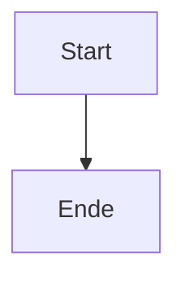

# Git Setup & Dokumentation committen

> Anleitung zum Committen der Dokumentation ins GitHub-Repository

---

## 📋 Voraussetzungen

- Git installiert
- GitHub-Repository erstellt
- Lokales Projekt initialisiert

---

## 🚀 Schnellstart

### 1. Git-Repository initialisieren (falls noch nicht geschehen)

```bash
cd /Users/herijeanmasum/Developer/quantiva-website

# Git initialisieren
git init

# Remote hinzufügen (ersetze mit deiner Repository-URL)
git remote add origin https://github.com/quantiva/quantiva-website.git

# Oder mit SSH
git remote add origin git@github.com:quantiva/quantiva-website.git
```

### 2. Dokumentation committen

```bash
# Status prüfen
git status

# Dokumentation hinzufügen
git add docs/
git add WORKFLOW_DOCUMENTATION.md
git add src/admin/components/WorkflowDiagram.tsx

# Commit erstellen
git commit -m "docs: Add comprehensive CMS workflow documentation

- Add workflow diagram with Mermaid
- Add role-based permissions matrix
- Add technical reference
- Add FAQ and best practices
- Add WorkflowDiagram React component
- Add interactive workflow viewer in Admin Dashboard"

# Pushen
git push -u origin main
```

### 3. Dokumentation aktualisieren

```bash
# Änderungen an Dokumentation
git add docs/cms-workflow.md

# Commit
git commit -m "docs: Update workflow documentation"

# Push
git push
```

---

## 📁 Dateien zum Committen

### Dokumentation
```
docs/
├── README.md              # Dokumentations-Übersicht
├── cms-workflow.md        # Vollständige Workflow-Dokumentation
└── GIT_SETUP.md          # Diese Datei

WORKFLOW_DOCUMENTATION.md  # Backup der Workflow-Docs
```

### Komponenten
```
src/admin/components/
└── WorkflowDiagram.tsx    # React-Komponente für Workflow-Diagramm
```

### Admin Dashboard
```
src/AdminDashboard.tsx     # Erweitert mit Workflow-Features
```

---

## 🔗 GitHub-Features nutzen

### Mermaid-Diagramme

GitHub rendert Mermaid-Diagramme automatisch! Das Workflow-Diagramm in `docs/cms-workflow.md` wird als interaktive Grafik angezeigt.

**Beispiel:**
```markdown

```

### GitHub Pages (optional)

Dokumentation als Website veröffentlichen:

```bash
# Erstelle gh-pages Branch
git checkout -b gh-pages

# Pushe Dokumentation
git push origin gh-pages
```

Dann in GitHub:
1. Settings → Pages
2. Source: `gh-pages` branch
3. Folder: `/docs`
4. Save

Dokumentation verfügbar unter: `https://quantiva.github.io/quantiva-website/`

---

## 📝 Commit-Konventionen

### Commit-Message-Format

```
<type>(<scope>): <subject>

<body>

<footer>
```

### Types
- `docs:` – Dokumentation
- `feat:` – Neue Features
- `fix:` – Bug-Fixes
- `refactor:` – Code-Refactoring
- `style:` – Code-Styling
- `test:` – Tests
- `chore:` – Build/Config

### Beispiele

```bash
# Dokumentation
git commit -m "docs: Add workflow documentation"
git commit -m "docs(workflow): Update role permissions matrix"

# Features
git commit -m "feat(admin): Add workflow diagram viewer"
git commit -m "feat(workflow): Implement role-based permissions"

# Fixes
git commit -m "fix(admin): Fix workflow button styling"
```

---

## 🔐 SSH-Key Setup (empfohlen)

### 1. SSH-Key generieren

```bash
ssh-keygen -t ed25519 -C "your_email@example.com"
```

### 2. SSH-Key zu GitHub hinzufügen

```bash
# Key kopieren
cat ~/.ssh/id_ed25519.pub | pbcopy

# Oder anzeigen
cat ~/.ssh/id_ed25519.pub
```

Dann in GitHub:
1. Settings → SSH and GPG keys
2. New SSH key
3. Paste key
4. Add SSH key

### 3. SSH verwenden

```bash
# Remote auf SSH umstellen
git remote set-url origin git@github.com:quantiva/quantiva-website.git

# Testen
ssh -T git@github.com
```

---

## 🌿 Branch-Strategie

### Main Branch (Production)

```bash
# Auf main arbeiten
git checkout main

# Änderungen committen
git add .
git commit -m "docs: Update documentation"
git push origin main
```

### Feature Branches

```bash
# Neuen Branch erstellen
git checkout -b docs/workflow-improvements

# Änderungen committen
git add docs/
git commit -m "docs: Improve workflow documentation"

# Push
git push origin docs/workflow-improvements

# Pull Request auf GitHub erstellen
```

### Release Branches

```bash
# Release Branch
git checkout -b release/v1.0.0

# Tag erstellen
git tag -a v1.0.0 -m "Release v1.0.0 - Workflow System"
git push origin v1.0.0
```

---

## 📦 .gitignore

Stelle sicher, dass folgende Dateien **nicht** committed werden:

```gitignore
# Dependencies
node_modules/

# Build
build/
dist/

# Environment
.env
.env.local

# IDE
.vscode/
.idea/

# OS
.DS_Store
Thumbs.db

# Logs
*.log
npm-debug.log*
```

---

## 🔄 Workflow

### Täglicher Workflow

```bash
# 1. Neueste Änderungen holen
git pull origin main

# 2. Änderungen machen
# ... edit files ...

# 3. Status prüfen
git status

# 4. Änderungen stagen
git add docs/

# 5. Committen
git commit -m "docs: Update workflow documentation"

# 6. Pushen
git push origin main
```

### Vor dem Commit

```bash
# Änderungen prüfen
git diff

# Staged Änderungen prüfen
git diff --staged

# Commit-Historie
git log --oneline
```

---

## 🆘 Troubleshooting

### "Permission denied" beim Push

```bash
# SSH-Key prüfen
ssh -T git@github.com

# Oder HTTPS mit Token verwenden
git remote set-url origin https://github.com/quantiva/quantiva-website.git
```

### Merge-Konflikte

```bash
# Konflikte anzeigen
git status

# Konflikte manuell lösen
# ... edit conflicted files ...

# Resolved markieren
git add <file>

# Merge fortsetzen
git commit
```

### Letzten Commit rückgängig machen

```bash
# Commit rückgängig (Änderungen behalten)
git reset --soft HEAD~1

# Commit rückgängig (Änderungen verwerfen)
git reset --hard HEAD~1
```

---

## 📚 Weiterführende Links

- **Git Documentation**: https://git-scm.com/doc
- **GitHub Docs**: https://docs.github.com
- **Mermaid Docs**: https://mermaid.js.org
- **Conventional Commits**: https://www.conventionalcommits.org

---

*Letzte Aktualisierung: Oktober 2025*

