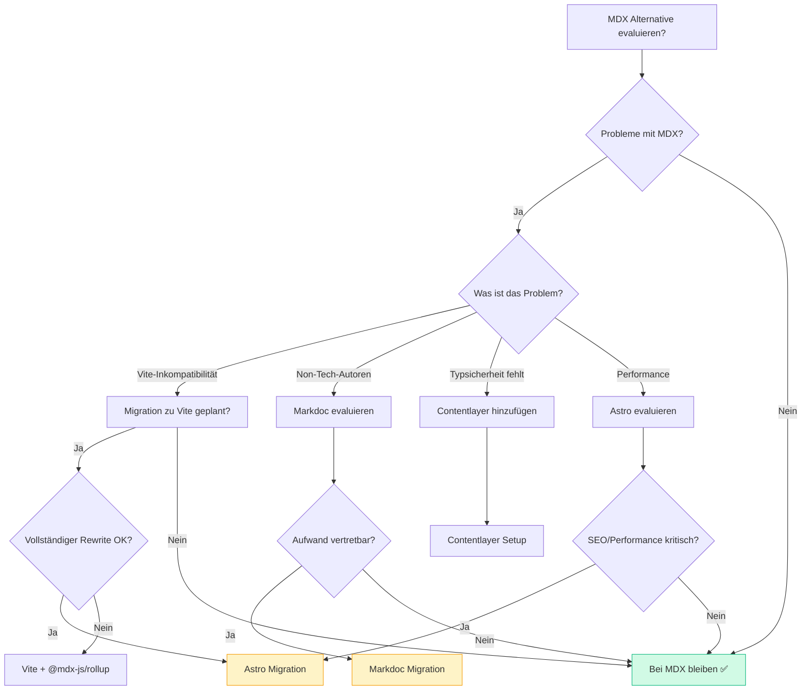

# MDX Alternativen – Vergleich & Migration Guide

> Übersicht über MDX-Alternativen und wann ein Wechsel sinnvoll ist

**Status:** 📚 Referenz-Dokumentation  
**Erstellt:** Oktober 2025  
**Aktueller Stand:** MDX mit CRA + CRACO (funktioniert ✅)

---

## 🎯 Executive Summary

**Aktuelle Situation:**
- ✅ MDX läuft stabil mit Create React App + CRACO
- ✅ 7 MDX-Dateien mit komplexer React-Integration
- ✅ `@mdx-js/loader` + `@mdx-js/react` konfiguriert

**Empfehlung:**
- 🟢 **Bei MDX bleiben** für aktuelles Setup
- 🔵 **Bei Vite-Migration:** Astro oder Vite + @mdx-js/rollup
- 🟡 **Bei Content-Fokus:** Markdoc oder Contentlayer evaluieren

---

## 📚 Alternativen zu MDX

### 1. Markdoc (von Stripe)

**Was ist es?**  
Ein MDX-ähnliches Format, das benutzerdefinierte Tags anstelle von JSX verwendet.

**Beispiel:**

```markdoc
# CMS Workflow


flowchart TD
  A[Start] --> B[End]



Alle Statusübergänge werden erfasst.

```

**Vorteile:**
- ✅ Saubere Syntax ohne JavaScript-Import
- ✅ Validierung & Typsicherheit für Tags
- ✅ Ideal für Non-Tech-Autoren
- ✅ Portabilität (reiner Text)

**Nachteile:**
- ❌ Weniger flexibel als MDX
- ❌ Migration aufwändig (alle 7 MDX-Dateien umschreiben)
- ❌ Keine React-Komponenten direkt nutzbar

**Setup:**

```bash
npm install @markdoc/markdoc @markdoc/next.js
```

**Vite-Konfiguration:**

```javascript
import markdoc from '@markdoc/vite-plugin'
import { defineConfig } from 'vite'

export default defineConfig({
  plugins: [markdoc()]
})
```

**Wann nutzen?**
- 📝 Content-Autoren ohne React-Kenntnisse
- 🎨 Wenn Inhalt und Code strikt getrennt bleiben sollen
- 📄 Für Dokumentationsseiten ohne komplexe Logik

---

### 2. Astro (Framework mit Vite)

**Was ist es?**  
Ein Meta-Framework auf Vite-Basis mit nativer Unterstützung für MDX und andere Frameworks.

**Beispiel:**

```mdx
---
title: 'CMS Workflow'
layout: '../../layouts/DocsLayout.astro'
---

import Mermaid from '@components/Mermaid.astro'
import { Link } from '@astrojs/router'

# {frontmatter.title}

<Mermaid>
{`flowchart TD
  A[Start] --> B[End]
`}
</Mermaid>

<Link to="/admin">Zum Dashboard →</Link>
```

**Vorteile:**
- ✅ Vite nativ, MDX "out of the box"
- ✅ Framework-agnostisch (React, Vue, Svelte gleichzeitig nutzbar)
- ✅ Minimales JavaScript im Browser (Island Architecture)
- ✅ Hervorragende Performance

**Nachteile:**
- ❌ Vollständige App-Umstellung nötig
- ❌ Lernkurve für Astro-Konzepte
- ❌ Alle React-Components müssen angepasst werden

**Setup:**

```bash
npm create astro@latest
npx astro add mdx
npx astro add react  # Optional für React-Komponenten
```

**Wann nutzen?**
- 🚀 Bei Neuaufbau oder kompletter Umstellung
- ⚡ Performance ist kritisch (statische Generierung)
- 🎨 Wenn Sie verschiedene UI-Frameworks mixen wollen
- 📦 Content-fokussierte Seiten

---

### 3. Contentlayer (Data Layer)

**Was ist es?**  
Ein Werkzeug, das MDX/Markdown-Dateien in typsichere JavaScript-Module umwandelt.

**Beispiel:**

**contentlayer.config.ts:**

```typescript
import { defineDocumentType, makeSource } from 'contentlayer/source-files'

export const Doc = defineDocumentType(() => ({
  name: 'Doc',
  filePathPattern: `**/*.mdx`,
  contentType: 'mdx',
  fields: {
    title: { type: 'string', required: true },
    description: { type: 'string', required: false },
    category: { type: 'enum', options: ['workflow', 'guide'], required: true },
  },
}))

export default makeSource({
  contentDirPath: 'src/docs/pages',
  documentTypes: [Doc],
})
```

**Verwendung:**

```tsx
import { allDocs } from 'contentlayer/generated'

const workflowDoc = allDocs.find((doc) => doc.category === 'workflow')

// Vollständig typisiert! ✅
console.log(workflowDoc.title)     // string
console.log(workflowDoc.category)  // 'workflow' | 'guide'
```

**Vorteile:**
- ✅ Volle TypeScript-Typsicherheit für Content
- ✅ Automatische Validierung beim Build
- ✅ Funktioniert MIT MDX (kein Ersatz, sondern Ergänzung)
- ✅ Hot Module Replacement

**Nachteile:**
- ❌ Zusätzliche Komplexität im Build-Prozess
- ❌ Hauptsächlich für Next.js optimiert
- ❌ Overhead für kleine Projekte

**Setup:**

```bash
npm install contentlayer next-contentlayer
```

**Next.js Config:**

```javascript
import { withContentlayer } from 'next-contentlayer'

export default withContentlayer({
  // Ihre Next.js Config
})
```

**Wann nutzen?**
- 🔒 Typsicherheit für Content ist kritisch
- 📊 Viele Content-Dateien (>20)
- ✅ Automatische Validierung gewünscht
- 🎯 Next.js-Projekt

---

### 4. Reines Markdown + Hydration

**Was ist es?**  
Standard Markdown mit nachträglichem Einbinden von React-Komponenten.

**Beispiel:**

**workflow.md:**

```markdown
# CMS Workflow

<div id="mermaid-diagram" data-chart="workflow"></div>

## Best Practices

<div id="callout-tips"></div>
```

**React:**

```tsx
import { marked } from 'marked'
import { useEffect } from 'react'
import ReactDOM from 'react-dom/client'

function DocsWorkflow() {
  const markdown = `...` // Markdown laden
  const html = marked.parse(markdown)

  useEffect(() => {
    // Nachträgliches Hydrieren
    const mermaidContainer = document.getElementById('mermaid-diagram')
    if (mermaidContainer) {
      const root = ReactDOM.createRoot(mermaidContainer)
      root.render(<Mermaid chart={...} />)
    }
  }, [])

  return <div dangerouslySetInnerHTML={{ __html: html }} />
}
```

**Vorteile:**
- ✅ Keine Build-Komplexität
- ✅ Funktioniert mit jedem Framework
- ✅ Standard Markdown-Tooling

**Nachteile:**
- ❌ Umständlich und fehleranfällig
- ❌ Keine Typsicherheit
- ❌ Schlechte Developer Experience
- ❌ SEO-Probleme (Client-Side Rendering)

**Wann nutzen?**
- 🚫 **Nicht empfohlen** für Ihr Projekt
- 📝 Nur für sehr simple Blogs
- ⚡ Wenn Build-Zeit absolut kritisch ist

---

## 🔄 Migration zu Vite

Falls Sie von CRA zu Vite migrieren möchten:

### Option A: Vite + MDX (Minimal-Migration)

**1. Dependencies aktualisieren:**

```bash
# Entfernen
npm uninstall react-scripts @craco/craco @mdx-js/loader

# Installieren
npm install vite @vitejs/plugin-react @mdx-js/rollup @types/mdx
```

**2. vite.config.ts erstellen:**

```typescript
import { defineConfig } from 'vite'
import react from '@vitejs/plugin-react'
import mdx from '@mdx-js/rollup'
import remarkGfm from 'remark-gfm'

export default defineConfig({
  plugins: [
    { enforce: 'pre', ...mdx({ remarkPlugins: [remarkGfm] }) },
    react(),
  ],
  resolve: {
    alias: {
      '@': '/src',
    },
  },
})
```

**3. index.html anpassen:**

```html
<!DOCTYPE html>
<html lang="de">
  <head>
    <meta charset="UTF-8" />
    <meta name="viewport" content="width=device-width, initial-scale=1.0" />
    <title>Quantiva Advisory</title>
  </head>
  <body>
    <div id="root"></div>
    <script type="module" src="/src/index.tsx"></script>
  </body>
</html>
```

**4. MDX-Typen definieren:**

**src/mdx.d.ts:**

```typescript
declare module '*.mdx' {
  import { ComponentType } from 'react'
  const Component: ComponentType
  export default Component
}
```

**5. package.json Scripts:**

```json
{
  "scripts": {
    "dev": "vite",
    "build": "tsc && vite build",
    "preview": "vite preview"
  }
}
```

**Aufwand:** ~2-4 Stunden  
**Risiko:** 🟡 Mittel (Testen erforderlich)

---

### Option B: Migration zu Astro (Empfohlen bei Neuaufbau)

**1. Neues Astro-Projekt:**

```bash
npm create astro@latest quantiva-docs
cd quantiva-docs
npx astro add mdx react tailwind
```

**2. Projekt-Struktur:**

```
src/
  components/
    Mermaid.astro      # Astro-Komponenten
    Callout.astro
  layouts/
    DocsLayout.astro
  pages/
    docs/
      cms-workflow.mdx
      index.mdx
```

**3. Komponenten portieren:**

```astro
---
// src/components/Mermaid.astro
const { chart } = Astro.props
---

<div class="mermaid">
  {chart}
</div>

<script>
  import mermaid from 'mermaid'
  mermaid.initialize({ startOnLoad: true })
</script>
```

**4. MDX-Dateien anpassen:**

```mdx
---
layout: ../../layouts/DocsLayout.astro
title: 'CMS Workflow'
---

import Mermaid from '../../components/Mermaid.astro'

# {frontmatter.title}

<Mermaid chart={`flowchart TD
  A[Start] --> B[End]
`} />
```

**Aufwand:** ~1-2 Tage  
**Risiko:** 🟠 Hoch (Vollständiger Rewrite)

---

## 📊 Vergleichstabelle

| Kriterium | MDX (aktuell) | Markdoc | Astro | Contentlayer | Markdown |
|-----------|---------------|---------|-------|--------------|----------|
| **Setup-Komplexität** | 🟡 Mittel | 🟡 Mittel | 🟠 Hoch | 🟠 Hoch | 🟢 Niedrig |
| **Vite-Kompatibilität** | 🟡 Plugin nötig | 🟢 Nativ | 🟢 Nativ | 🟡 Plugin | 🟢 Nativ |
| **React-Integration** | 🟢 Perfekt | 🟡 Adapter | 🟢 Gut | 🟢 Perfekt | 🔴 Manuell |
| **TypeScript-Support** | 🟢 Gut | 🟢 Sehr gut | 🟢 Sehr gut | 🟢 Exzellent | 🔴 Keiner |
| **Non-Tech-Autoren** | 🔴 Schwer | 🟢 Einfach | 🟡 Mittel | 🟡 Mittel | 🟢 Einfach |
| **Interaktivität** | 🟢 Hoch | 🟡 Mittel | 🟢 Hoch | 🟢 Hoch | 🔴 Keine |
| **Build-Performance** | 🟡 Gut | 🟢 Sehr gut | 🟢 Exzellent | 🟡 Gut | 🟢 Sehr gut |
| **Migrations-Aufwand** | ✅ N/A | 🟠 Hoch | 🔴 Sehr hoch | 🟡 Mittel | 🟡 Mittel |
| **Community & Support** | 🟢 Groß | 🟡 Mittel | 🟢 Wachsend | 🟡 Klein | 🟢 Etabliert |

---

## 🎯 Entscheidungsbaum



---

## 💡 Empfehlung für Quantiva Advisory

### Aktuelles Setup beibehalten (MDX + CRA + CRACO)

**Gründe:**
- ✅ Funktioniert stabil und zuverlässig
- ✅ Team ist mit React/TypeScript vertraut
- ✅ 7 MDX-Dateien mit komplexer Integration
- ✅ Keine akuten Probleme

**Nächste Schritte:**
- 📝 Diese Dokumentation als Referenz nutzen
- 🔄 Bei zukünftiger Vite-Migration: Option A (Vite + @mdx-js/rollup)
- 🎯 Contentlayer evaluieren, wenn Content-Menge wächst (>20 Dateien)

### Nur bei folgenden Ereignissen migrieren:

1. **Vite-Migration wird Pflicht** → Vite + @mdx-js/rollup
2. **Performance-Probleme** → Astro evaluieren
3. **Non-Tech-Team schreibt Docs** → Markdoc evaluieren
4. **Content-Menge explodiert** → Contentlayer hinzufügen

---

## 📚 Ressourcen

### Offizielle Dokumentation
- **MDX:** https://mdxjs.com/
- **Markdoc:** https://markdoc.dev/
- **Astro:** https://astro.build/
- **Contentlayer:** https://contentlayer.dev/

### Migration Guides
- **CRA → Vite:** https://vitejs.dev/guide/migration.html
- **React → Astro:** https://docs.astro.build/en/guides/migrate-to-astro/
- **MDX → Markdoc:** https://markdoc.dev/docs/migration

### Community
- **MDX Discord:** https://discord.gg/mdx
- **Astro Discord:** https://astro.build/chat
- **Vite Discord:** https://chat.vitejs.dev/

---

## ✅ Zusammenfassung

**Status Quo:**
- 🟢 MDX funktioniert einwandfrei
- 🟢 CRA + CRACO ist stabil
- 🟢 Team ist produktiv

**Empfehlung:**
- ✅ **Bei MDX bleiben**
- 📚 **Diese Dokumentation als Referenz**
- 🔄 **Bei Bedarf zu Vite + @mdx-js/rollup**

**Migration nur wenn:**
- ⚡ Vite wird Pflicht
- 📈 Performance wird kritisch
- 👥 Non-Tech-Autoren kommen hinzu
- 📚 Content-Menge >20 Dateien

---

**Erstellt:** Oktober 2025  
**Nächste Review:** Bei Projekt-Milestone oder nach 6 Monaten  
**Maintainer:** Quantiva Advisory Development Team


