# 🎨 Mermaid Integration Guide - Complete Setup

> Vollständiger Leitfaden zur Integration von Mermaid-Diagrammen in die Quantiva Advisory Website

---

## 📋 Übersicht

Dieses Projekt verwendet **Mermaid** für interaktive Diagramm-Visualisierungen in:
- ✅ GitHub Markdown (automatisches Rendering)
- ✅ React-Komponenten (Client-side Rendering)
- ✅ Dedizierte Dokumentations-Seiten

---

## 🎯 Implementierung

### 1. Installation

```bash
npm install mermaid
npm install --save-dev @types/mermaid  # Optional für TypeScript
```

**Installierte Version:**
- `mermaid`: ^10.x.x
- Verwendet in: React-Komponenten

---

### 2. React-Komponente

**Datei:** `src/components/Mermaid.tsx`

```typescript
import React from 'react';
import mermaid from 'mermaid';

mermaid.initialize({ startOnLoad: false, theme: 'default' });

type MermaidProps = {
  children: string;
  chartKey?: string;
  className?: string;
};

export default function Mermaid({ children, chartKey, className }: MermaidProps) {
  const ref = React.useRef<HTMLDivElement>(null);

  React.useEffect(() => {
    if (!ref.current) return;
    const render = async () => {
      try {
        const id = `mermaid-${chartKey ?? Math.random().toString(36).slice(2)}`;
        const { svg } = await mermaid.render(id, children);
        ref.current!.innerHTML = svg;
      } catch (e) {
        ref.current!.innerHTML = `<pre style="color:#ef4444;white-space:pre-wrap;">${String(e)}</pre>`;
      }
    };
    render();
  }, [children, chartKey]);

  return <div ref={ref} className={className} />;
}
```

**Features:**
- ✅ Client-side Rendering
- ✅ Error Handling
- ✅ Unique Chart IDs
- ✅ Custom Styling Support
- ✅ TypeScript Support

---

### 3. Dokumentations-Seite

**Datei:** `src/pages/DocsWorkflow.tsx`

```typescript
import React from 'react';
import Mermaid from '../components/Mermaid';

const DocsWorkflow: React.FC = () => {
  const mermaidChart = `flowchart TD
    A[Entwurf (draft)] -->|Zur Prüfung| B[Zur Prüfung (inReview)]
    B -->|Freigeben| C[Freigegeben (approved)]
    B -->|Ablehnen| D[Abgelehnt (rejected)]
    C -->|Veröffentlichen| E[Veröffentlicht (published)]
    E -->|Unpublish| C
    B -->|Zurück zu Entwurf| A
    C -->|Zurück zu Entwurf| A
    D -->|Zurück zu Entwurf| A
  `;

  return (
    <div className="container mx-auto p-8 dark:bg-slate-950 dark:text-slate-100">
      <h1 className="text-4xl font-bold mb-6">Quantiva CMS – Workflow</h1>
      <Mermaid chartKey="cms-workflow-page">{mermaidChart}</Mermaid>
      {/* Weitere Dokumentation... */}
    </div>
  );
};

export default DocsWorkflow;
```

---

### 4. Routing-Integration

**Datei:** `src/App.tsx`

```typescript
import DocsWorkflow from './pages/DocsWorkflow';

function App() {
  return (
    <Router>
      <Routes>
        {/* Bestehende Routes... */}
        <Route path="/docs/cms-workflow" element={<DocsWorkflow />} />
      </Routes>
    </Router>
  );
}
```

---

## 📚 GitHub Markdown Integration

### Automatisches Rendering auf GitHub

GitHub rendert Mermaid-Diagramme automatisch in `.md`-Dateien!

**Datei:** `docs/cms-workflow.md`

````markdown
# CMS Workflow

```mermaid
flowchart TD
    A[Entwurf] -->|Zur Prüfung| B[In Review]
    B -->|Freigeben| C[Approved]
    C -->|Veröffentlichen| D[Published]
```



## Beschreibung...
````

**GitHub rendert dies als interaktive Grafik!** ✨

---

## 🎨 Styling & Theming

### Mermaid-Theme konfigurieren

```typescript
mermaid.initialize({
  startOnLoad: false,
  theme: 'default',        // oder 'dark', 'forest', 'neutral'
  themeVariables: {
    primaryColor: '#0f766e',
    primaryTextColor: '#fff',
    primaryBorderColor: '#0d9488',
    lineColor: '#14b8a6',
    secondaryColor: '#06b6d4',
    tertiaryColor: '#f0fdfa',
  },
});
```

### Custom CSS für Diagramme

```css
.mermaid-container {
  background: linear-gradient(to bottom, #0f172a, #1e293b);
  border-radius: 12px;
  padding: 2rem;
  box-shadow: 0 10px 40px rgba(0, 0, 0, 0.3);
}

.mermaid-container svg {
  max-width: 100%;
  height: auto;
}
```

---

## 🔧 Verwendung im Projekt

### 1. CMS Workflow Dokumentation

**URL:** `/docs/cms-workflow`

**Zeigt:**
- Flowchart: Draft → Review → Approved → Published
- Rollen-Matrix
- Berechtigungen
- Technische Referenz

### 2. Admin Dashboard - Workflow Diagram

**Datei:** `src/admin/components/WorkflowDiagram.tsx`

**Features:**
- Interaktives Workflow-Diagramm
- Rollen-Berechtigungen
- Transition-Matrix
- Visual Status-Indikatoren

### 3. GitHub Dokumentation

**Dateien:**
- `docs/cms-workflow.md` - Vollständige Workflow-Docs
- `README.md` - Projekt-Übersicht
- `DOCUMENTATION_SUMMARY.md` - Zusammenfassung

**Alle Mermaid-Diagramme werden auf GitHub automatisch gerendert!**

---

## 📊 Diagramm-Typen

### Flowchart (Workflow)

```typescript
const flowchart = `flowchart TD
  A[Start] --> B{Entscheidung}
  B -->|Ja| C[Aktion 1]
  B -->|Nein| D[Aktion 2]
  C --> E[Ende]
  D --> E
`;
```

### Sequence Diagram

```typescript
const sequence = `sequenceDiagram
  participant U as User
  participant A as Admin
  participant S as System
  U->>A: Submit for Review
  A->>S: Validate
  S-->>A: Valid
  A->>U: Approved
`;
```

### Class Diagram

```typescript
const classDiagram = `classDiagram
  class CaseItem {
    +string slug
    +string status
    +string owner
    +changeStatus()
    +validate()
  }
`;
```

### Gantt Chart

```typescript
const gantt = `gantt
  title Projekt Timeline
  dateFormat YYYY-MM-DD
  section Phase 1
  Setup :a1, 2025-01-01, 7d
  Development :a2, after a1, 14d
`;
```

---

## 🚀 Performance-Optimierung

### Lazy Loading

```typescript
import { lazy, Suspense } from 'react';

const Mermaid = lazy(() => import('./components/Mermaid'));

function DocsPage() {
  return (
    <Suspense fallback={<div>Loading diagram...</div>}>
      <Mermaid>{diagramCode}</Mermaid>
    </Suspense>
  );
}
```

### Memoization

```typescript
const MermaidMemo = React.memo(Mermaid, (prev, next) => {
  return prev.children === next.children;
});
```

### Code Splitting

Die `Mermaid`-Komponente wird automatisch mit React Code Splitting optimiert.

---

## 🐛 Troubleshooting

### Problem: Diagramm wird nicht gerendert

**Lösung:**
```typescript
// Stelle sicher, dass mermaid.initialize() vor dem ersten Render aufgerufen wird
mermaid.initialize({ startOnLoad: false });
```

### Problem: Syntax-Fehler im Diagramm

**Lösung:**
```typescript
// Verwende Error Boundary für besseres Error Handling
try {
  const { svg } = await mermaid.render(id, children);
  ref.current!.innerHTML = svg;
} catch (e) {
  console.error('Mermaid Error:', e);
  ref.current!.innerHTML = `<pre>Syntax Error: ${String(e)}</pre>`;
}
```

### Problem: TypeScript-Fehler

**Lösung:**
```bash
npm install --save-dev @types/mermaid
```

Oder füge zu `src/react-app-env.d.ts` hinzu:
```typescript
declare module 'mermaid' {
  const mermaid: any;
  export default mermaid;
}
```

---

## 📖 Ressourcen

### Offizielle Dokumentation
- **Mermaid Docs:** https://mermaid.js.org/
- **Live Editor:** https://mermaid.live/
- **GitHub Docs:** https://docs.github.com/en/get-started/writing-on-github/working-with-advanced-formatting/creating-diagrams

### Projekt-spezifische Links
- **Workflow Docs:** `/docs/cms-workflow`
- **Live Preview:** http://localhost:3000/docs/cms-workflow
- **GitHub:** https://github.com/Masum187/Quantiva-Advisory/blob/main/docs/cms-workflow.md

### Beispiele im Projekt
- `src/components/Mermaid.tsx` - Basis-Komponente
- `src/pages/DocsWorkflow.tsx` - Dokumentations-Seite
- `src/admin/components/WorkflowDiagram.tsx` - Admin-Diagramm
- `docs/cms-workflow.md` - GitHub Markdown

---

## ✅ Checkliste

- [x] Mermaid npm-Package installiert
- [x] Mermaid React-Komponente erstellt
- [x] Dokumentations-Seite implementiert
- [x] Route für `/docs/cms-workflow` hinzugefügt
- [x] GitHub Markdown-Dokumentation erstellt
- [x] TypeScript-Types konfiguriert
- [x] Error Handling implementiert
- [x] Performance-Optimierung (Lazy Loading)
- [x] Custom Styling angewendet
- [x] Live-Tests durchgeführt

---

## 🎉 Ergebnis

**Verfügbare Mermaid-Diagramme:**
1. ✅ Workflow Flowchart (Draft → Published)
2. ✅ Rollen-Matrix
3. ✅ Admin Dashboard Workflow
4. ✅ GitHub Dokumentation

**Rendering:**
- ✅ GitHub Markdown (automatisch)
- ✅ React App (client-side)
- ✅ Responsive & Interaktiv
- ✅ Error Handling

---

**Status:** ✅ Vollständig implementiert und getestet  
**Erstellt:** Oktober 2025  
**Version:** 1.0.0


