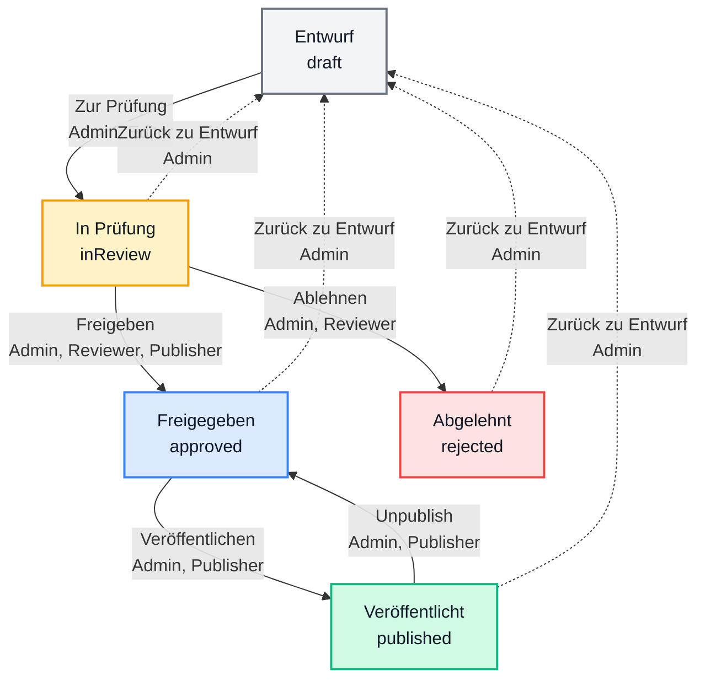

# CMS Workflow & Berechtigungssystem

> **Quantiva Enterprise CMS** – Rollenbasiertes Workflow-System für Content Management

> ⚠️ **SECURITY WARNING - SERVER-ONLY CODE**  
> This documentation contains example code with `process.env` variables (VERCEL_TOKEN, SLACK_WEBHOOK_URL, JWT_SECRET).  
> **These examples must ONLY run on the server** (API routes, serverless functions, server-side code).  
> **NEVER expose environment variables or secrets to the client-side bundle!**  
> All code using `process.env` is marked with `⚠️ SERVER-ONLY` comments.

---

## 📋 Inhaltsverzeichnis

- [Übersicht](#übersicht)
- [Status-Flow](#status-flow)
- [Rollen & Berechtigungen](#rollen--berechtigungen)
- [Workflow-Diagramm](#workflow-diagramm)
- [Technische Referenz](#technische-referenz)
- [Best Practices](#best-practices)
- [Erweiterungen](#erweiterungen)
- [FAQ](#faq)

---

## Übersicht

Das Quantiva CMS verwendet ein **5-stufiges Workflow-System** mit **5 Rollen** für strukturiertes Content Management:

### Status-Stufen
- 🟤 **draft** – Entwurf (Bearbeitung)
- 🟡 **inReview** – In Prüfung (Review)
- 🔵 **approved** – Freigegeben (Bereit zur Publikation)
- 🔴 **rejected** – Abgelehnt (Überarbeitung nötig)
- 🟢 **published** – Veröffentlicht (Live)

### Rollen
- 🔴 **Admin** – Vollzugriff auf alle Funktionen
- 🟢 **Editor** – Erstellen & Bearbeiten
- 🟡 **Reviewer** – Qualitätssicherung
- 🔵 **Publisher** – Publikationsmanagement
- ⚪ **Viewer** – Nur Leserechte

---

## Status-Flow



### Workflow-Pfade

#### Hauptpfad (Happy Path)
```
draft → inReview → approved → published
```

#### Alternative Pfade
```
inReview → rejected → (Überarbeitung) → draft → inReview
published → approved (Unpublish) → (Änderungen) → published
```

#### Admin-Rückweg
```
Jeder Status → draft (nur Admin)
```

---

## Rollen & Berechtigungen

### Berechtigungs-Matrix

| Aktion | Von → Nach | Admin | Editor | Reviewer | Publisher | Viewer |
|--------|-----------|:-----:|:------:|:--------:|:---------:|:------:|
| **Zur Prüfung** | draft → inReview | ✅ | ✅ | ❌ | ❌ | ❌ |
| **Freigeben** | inReview → approved | ✅ | ❌ | ✅ | ✅ | ❌ |
| **Ablehnen** | inReview → rejected | ✅ | ❌ | ✅ | ❌ | ❌ |
| **Veröffentlichen** | approved → published | ✅ | ❌ | ❌ | ✅ | ❌ |
| **Unpublish** | published → approved | ✅ | ❌ | ❌ | ✅ | ❌ |
| **Zurück zu Entwurf** | * → draft | ✅ | ❌ | ❌ | ❌ | ❌ |
| **Cases erstellen** | - | ✅ | ✅ | ❌ | ❌ | ❌ |
| **Cases bearbeiten** | - | ✅ | ✅ | ❌ | ❌ | ❌ |
| **Cases löschen** | - | ✅ | ❌ | ❌ | ❌ | ❌ |
| **History verwalten** | - | ✅ | ❌ | ❌ | ❌ | ❌ |

### Rollen-Details

#### 🔴 Admin
**Vollzugriff auf alle Funktionen**

- Kann jeden Status in jeden anderen Status überführen
- Kann Cases erstellen, bearbeiten und löschen
- Kann History exportieren/importieren
- Kann Bulk-Operationen durchführen
- Zugriff auf alle Admin-Funktionen

**Typische Aufgaben:**
- System-Administration
- Notfall-Interventionen
- Workflow-Überwachung
- Daten-Management

#### 🟢 Editor
**Content-Erstellung und -Bearbeitung**

- Kann Cases erstellen und bearbeiten
- Kann Cases zur Prüfung einreichen (`draft → inReview`)
- Kann eigene Draft-Cases bearbeiten
- **Keine** Freigabe- oder Veröffentlichungsrechte

**Typische Aufgaben:**
- Content-Erstellung
- Case-Dokumentation
- Medien-Upload
- Metadaten-Pflege

#### 🟡 Reviewer
**Qualitätssicherung**

- Kann Cases freigeben (`inReview → approved`)
- Kann Cases ablehnen (`inReview → rejected`)
- **Keine** Veröffentlichungsrechte
- **Keine** Bearbeitungsrechte

**Typische Aufgaben:**
- Content-Review
- Qualitätskontrolle
- Feedback geben
- Freigabe-Entscheidungen

#### 🔵 Publisher
**Publikationsmanagement**

- Kann freigegebene Cases veröffentlichen (`approved → published`)
- Kann veröffentlichte Cases zurückziehen (`published → approved`)
- Kann Cases freigeben (`inReview → approved`)
- **Keine** Bearbeitungsrechte

**Typische Aufgaben:**
- Publikations-Timing
- Go-Live Koordination
- Veröffentlichungs-Monitoring
- Unpublish bei Bedarf

#### ⚪ Viewer
**Nur Leserechte**

- Kann Cases ansehen
- **Keine** Bearbeitungsrechte
- **Keine** Workflow-Rechte
- Alle Buttons sind deaktiviert

**Typische Aufgaben:**
- Reporting
- Stakeholder-Ansicht
- Audit-Zwecke
- Read-Only Zugriff

---

## Workflow-Diagramm

### Im Admin Dashboard anzeigen

Das interaktive Workflow-Diagramm ist direkt im Admin Dashboard verfügbar:

1. Öffnen Sie das **Admin Dashboard** (`/admin`)
2. Klicken Sie auf **"Workflow"** Button (Toolbar, rechts)
3. Sehen Sie den vollständigen Status-Flow und die Rollen-Matrix

### Komponente einbetten

```tsx
import WorkflowDiagram from './admin/components/WorkflowDiagram';

function MyComponent() {
  return (
    <div>
      <h1>CMS Workflow</h1>
      <WorkflowDiagram />
    </div>
  );
}
```

---

## Technische Referenz

### TypeScript-Typen

```typescript
// Status-Typen
type CaseStatus = 
  | "draft" 
  | "inReview" 
  | "approved" 
  | "rejected" 
  | "published" 
  | null;

// Rollen-Typen
type UserRole = 
  | "Admin" 
  | "Editor" 
  | "Reviewer" 
  | "Publisher" 
  | "Viewer";

// Case-Item mit Workflow-Feldern
type CaseItem = {
  slug: string;
  // ... andere Felder
  
  // Workflow-Felder
  status?: CaseStatus;
  owner?: string | null;
  reviewers?: string[];
  publishedAt?: string | null; // ISO 8601
};
```

### Berechtigungsprüfung

```typescript
// Helper-Funktion
function can(userRole: UserRole, allowedRoles: UserRole[]): boolean {
  return allowedRoles.includes(userRole);
}

// Verwendung in Komponenten
<Button 
  disabled={!can(currentUserRole, ["Admin", "Editor"])}
  onClick={() => submitForReview(case.slug)}
>
  Zur Prüfung
</Button>

// Verwendung in Funktionen
function submitForReview(slug: string) {
  if (!can(currentUserRole, ["Admin", "Editor"])) {
    throw new Error("Keine Berechtigung");
  }
  
  setItems(prev => prev.map(p => 
    p.slug === slug ? { ...p, status: "inReview" } : p
  ));
  
  showToast("Zur Prüfung eingereicht");
}
```

### Status-Übergänge

```typescript
// Zustandsmaschine (State Machine)
const transitions = {
  draft: {
    to: ["inReview"],
    guard: ["Admin", "Editor"]
  },
  inReview: {
    to: ["approved", "rejected", "draft"],
    guard: {
      approved: ["Admin", "Reviewer", "Publisher"],
      rejected: ["Admin", "Reviewer"],
      draft: ["Admin"]
    }
  },
  approved: {
    to: ["published", "draft"],
    guard: {
      published: ["Admin", "Publisher"],
      draft: ["Admin"]
    }
  },
  rejected: {
    to: ["draft"],
    guard: ["Admin"]
  },
  published: {
    to: ["approved", "draft"],
    guard: {
      approved: ["Admin", "Publisher"],
      draft: ["Admin"]
    }
  }
};

// Validierung
function canTransition(
  from: CaseStatus,
  to: CaseStatus,
  userRole: UserRole
): boolean {
  const transition = transitions[from];
  if (!transition) return false;
  
  if (!transition.to.includes(to)) return false;
  
  const guard = transition.guard;
  if (typeof guard === "object") {
    return can(userRole, guard[to]);
  }
  
  return can(userRole, guard);
}
```

### Automatische Zeitstempel

```typescript
// Bei Veröffentlichung
function publishCase(slug: string) {
  setItems(prev => prev.map(p => 
    p.slug === slug 
      ? { 
          ...p, 
          status: "published", 
          publishedAt: new Date().toISOString() 
        } 
      : p
  ));
  
  showToast("Veröffentlicht");
}

// Bei Unpublish
function unpublishCase(slug: string) {
  setItems(prev => prev.map(p => 
    p.slug === slug 
      ? { 
          ...p, 
          status: "approved", 
          publishedAt: null 
        } 
      : p
  ));
  
  showToast("Veröffentlichung aufgehoben");
}
```

---

## Best Practices

### 1. Workflow-Disziplin

✅ **DO:**
- Immer über den offiziellen Workflow gehen
- Kommentare bei Ablehnung hinzufügen
- Preview vor Veröffentlichung testen
- Vier-Augen-Prinzip einhalten

❌ **DON'T:**
- Keine direkten Status-Sprünge (z.B. `draft → published`)
- Nicht eigene Cases freigeben (Editor ≠ Reviewer)
- Keine Veröffentlichung ohne Freigabe
- Nicht ohne Kommentar ablehnen

### 2. Rollen-Trennung

**Vier-Augen-Prinzip:**
```
Editor (erstellt) ≠ Reviewer (prüft) ≠ Publisher (veröffentlicht)
```

**Separation of Duties:**
- Content-Erstellung: Editor
- Qualitätssicherung: Reviewer
- Publikation: Publisher
- Administration: Admin

### 3. Qualitätssicherung

**Checkliste vor Freigabe:**
- [ ] Alle Pflichtfelder ausgefüllt
- [ ] Bilder/Videos hochgeladen
- [ ] Rechtschreibung geprüft
- [ ] Links funktionieren
- [ ] Metadaten vollständig
- [ ] Preview getestet
- [ ] SEO-Optimierung

### 4. Kommunikation

**Bei Submission (Editor → Reviewer):**
```
"Case XYZ zur Prüfung eingereicht. 
Bitte bis Freitag reviewen. 
Fokus: Technische Korrektheit."
```

**Bei Ablehnung (Reviewer → Editor):**
```
"Case XYZ abgelehnt. 
Gründe:
- Bild fehlt in Sektion 2
- Titel zu lang (max 60 Zeichen)
- Tech-Stack nicht vollständig
Bitte überarbeiten und erneut einreichen."
```

**Bei Veröffentlichung (Publisher → Team):**
```
"Case XYZ veröffentlicht! 🎉
Live: https://quantiva.com/cases/xyz
Nächste Schritte: Social Media Posts"
```

---

## Erweiterungen

### 1. Automatische Reviewer-Zuweisung

```typescript
// Bei Submission automatisch Reviewer benachrichtigen
function submitForReview(caseSlug: string) {
  const caseItem = findCase(caseSlug);
  
  // Status ändern
  updateStatus(caseSlug, 'inReview');
  
  // Owner benachrichtigen
  if (caseItem.owner) {
    sendNotification(caseItem.owner, {
      type: 'info',
      title: 'Case zur Prüfung eingereicht',
      message: `Ihr Case "${caseItem.titleDe}" wurde zur Prüfung eingereicht.`
    });
  }
  
  // Reviewer benachrichtigen
  if (caseItem.reviewers?.length) {
    caseItem.reviewers.forEach(reviewer => {
      sendNotification(reviewer, {
        type: 'task',
        title: 'Neuer Case zur Prüfung',
        message: `Bitte reviewen Sie: "${caseItem.titleDe}"`,
        action: {
          label: 'Zum Review',
          url: `/admin?case=${caseSlug}`
        }
      });
      
      // Task erstellen
      createTask(reviewer, {
        title: `Review: ${caseItem.titleDe}`,
        dueDate: addDays(new Date(), 3), // 3 Tage
        priority: 'medium'
      });
    });
  }
}
```

### 2. Audit-Log

```typescript
type AuditEntry = {
  id: string;
  timestamp: string;
  user: string;
  userRole: UserRole;
  caseSlug: string;
  action: 'status_change' | 'create' | 'update' | 'delete';
  fromStatus?: CaseStatus;
  toStatus?: CaseStatus;
  comment?: string;
  metadata?: Record<string, any>;
};

// Audit-Log bei jeder Aktion
function logAudit(entry: Omit<AuditEntry, 'id' | 'timestamp'>) {
  const auditEntry: AuditEntry = {
    id: generateId(),
    timestamp: new Date().toISOString(),
    ...entry
  };
  
  // In Datenbank speichern
  await db.auditLog.create(auditEntry);
  
  // Optional: In externe Audit-Systeme senden
  await sendToAuditSystem(auditEntry);
}

// Verwendung
function approveCase(slug: string, comment: string) {
  const caseItem = findCase(slug);
  
  updateStatus(slug, 'approved');
  
  logAudit({
    user: currentUser.email,
    userRole: currentUser.role,
    caseSlug: slug,
    action: 'status_change',
    fromStatus: caseItem.status,
    toStatus: 'approved',
    comment: comment
  });
}
```

### 3. Publish-Hooks & Webhooks

```typescript
// Webhook-System
type WebhookEvent = {
  event: 'case.published' | 'case.unpublished' | 'case.approved';
  timestamp: string;
  case: CaseItem;
  user: string;
};

async function publishCase(slug: string) {
  const caseItem = findCase(slug);
  
  // Status ändern
  updateStatus(slug, 'published', { 
    publishedAt: new Date().toISOString() 
  });
  
  // Webhooks triggern
  const webhookEvent: WebhookEvent = {
    event: 'case.published',
    timestamp: new Date().toISOString(),
    case: caseItem,
    user: currentUser.email
  };
  
  await Promise.all([
    // Vercel Deployment triggern
    // ⚠️ SERVER-ONLY: This code must run on the server (API route or serverless function)
    // Never expose VERCEL_TOKEN or other secrets to the client!
    fetch('https://api.vercel.com/v1/deployments', {
      method: 'POST',
      headers: {
        Authorization: `Bearer ${process.env.VERCEL_TOKEN}`, // ⚠️ SERVER-ONLY
        'Content-Type': 'application/json'
      },
      body: JSON.stringify({
        name: 'quantiva-website',
        target: 'production'
      })
    }),
    
    // Slack-Benachrichtigung
    // ⚠️ SERVER-ONLY: Webhook URLs must never be exposed to the client!
    fetch(process.env.SLACK_WEBHOOK_URL, { // ⚠️ SERVER-ONLY
      method: 'POST',
      headers: { 'Content-Type': 'application/json' },
      body: JSON.stringify({
        text: `✅ Case "${caseItem.titleDe}" wurde veröffentlicht!`,
        blocks: [
          {
            type: 'section',
            text: {
              type: 'mrkdwn',
              text: `*Case veröffentlicht*\n\n*Titel:* ${caseItem.titleDe}\n*Slug:* ${slug}\n*Von:* ${currentUser.email}`
            }
          },
          {
            type: 'actions',
            elements: [
              {
                type: 'button',
                text: { type: 'plain_text', text: 'Ansehen' },
                url: `https://quantiva.com/cases/${slug}`
              }
            ]
          }
        ]
      })
    }),
    
    // Search-Index aktualisieren
    updateSearchIndex(caseItem),
    
    // CRM/DAM Sync
    syncToCRM(caseItem),
    
    // Custom Webhooks
    triggerWebhooks(webhookEvent)
  ]);
  
  showToast('Veröffentlicht & Webhooks getriggert');
}
```

### 4. Draft-Preview-Links

```typescript
import jwt from 'jsonwebtoken';

// Signierte Preview-Links generieren
function generatePreviewLink(
  caseSlug: string, 
  expiresIn: number = 24 * 60 * 60 // 24 Stunden
): string {
  // ⚠️ SERVER-ONLY: JWT signing must happen on the server
  // Never expose JWT_SECRET to the client!
  const token = jwt.sign(
    {
      slug: caseSlug,
      type: 'preview',
      generatedBy: currentUser.email
    },
    process.env.JWT_SECRET, // ⚠️ SERVER-ONLY
    { expiresIn }
  );
  
  return `https://quantiva.com/preview/${caseSlug}?token=${token}`;
}

// In der UI
<Button 
  variant="outline"
  onClick={() => {
    const link = generatePreviewLink(case.slug);
    navigator.clipboard.writeText(link);
    showToast('Preview-Link kopiert! Gültig für 24h.');
  }}
>
  <Eye className="h-4 w-4" />
  Preview-Link generieren
</Button>

// Preview-Route (Next.js)
export async function getServerSideProps(context) {
  const { slug, token } = context.query;
  
  try {
    // ⚠️ SERVER-ONLY: JWT verification must happen on the server
    const decoded = jwt.verify(token, process.env.JWT_SECRET); // ⚠️ SERVER-ONLY
    
    if (decoded.slug !== slug || decoded.type !== 'preview') {
      throw new Error('Invalid token');
    }
    
    const caseItem = await fetchCase(slug);
    
    return {
      props: {
        case: caseItem,
        isPreview: true
      }
    };
  } catch (error) {
    return {
      redirect: {
        destination: '/404',
        permanent: false
      }
    };
  }
}
```

---

## FAQ

### Allgemeine Fragen

**Q: Kann ein Editor seinen eigenen Case freigeben?**  
A: Nein. Das Vier-Augen-Prinzip erfordert, dass ein **Reviewer** oder **Publisher** die Freigabe erteilt. Dies gewährleistet Qualitätssicherung.

**Q: Was passiert bei Ablehnung?**  
A: Der Case erhält den Status `rejected`. Nur ein **Admin** kann ihn zurück zu `draft` setzen, wo der **Editor** ihn überarbeiten kann. Der Reviewer sollte einen Kommentar mit Verbesserungsvorschlägen hinterlassen.

**Q: Kann ein veröffentlichter Case bearbeitet werden?**  
A: Nicht direkt. Der Workflow ist:
1. **Publisher**: "Unpublish" (`published → approved`)
2. **Admin**: "Zurück zu Entwurf" (`approved → draft`)
3. **Editor**: Bearbeitung durchführen
4. Erneuter Workflow: `draft → inReview → approved → published`

**Q: Wie funktioniert die History?**  
A: Alle Änderungen werden automatisch mit **300ms Debouncing** gespeichert. Max. **75 Snapshots** werden in der Session gespeichert. History kann exportiert/importiert werden.

**Q: Wer kann Cases löschen?**  
A: Nur **Admins** können Cases löschen. Dies ist eine Sicherheitsmaßnahme gegen versehentliches Löschen.

### Technische Fragen

**Q: Wie werden Berechtigungen geprüft?**  
A: Mit der `can(userRole, allowedRoles)` Funktion. Buttons werden automatisch disabled, wenn keine Berechtigung vorliegt.

**Q: Wo wird der aktuelle User gespeichert?**  
A: Im State: `const [currentUserRole, setCurrentUserRole] = useState<UserRole>("Admin")`. In Production würde dies aus einem Auth-Context kommen.

**Q: Kann ich die Rollen erweitern?**  
A: Ja! Fügen Sie einfach neue Rollen zum `UserRole` Type hinzu und passen Sie die `can()` Guards in den Workflow-Buttons an.

**Q: Wie funktioniert das Undo/Redo?**  
A: Jede Änderung wird in einem History-Stack gespeichert. Undo nimmt den vorletzten Snapshot, Redo den nächsten aus dem Redo-Stack.

**Q: Werden Statuswechsel in der History erfasst?**  
A: Ja, alle Statuswechsel werden automatisch erfasst und können rückgängig gemacht werden.

### Workflow-Fragen

**Q: Kann ich Schritte überspringen?**  
A: Nein. Der Workflow muss sequenziell durchlaufen werden (außer Admin kann direkt zu `draft` zurück).

**Q: Was ist der Unterschied zwischen Reviewer und Publisher?**  
A: **Reviewer** prüft die Qualität (`inReview → approved/rejected`). **Publisher** managed die Veröffentlichung (`approved → published`).

**Q: Kann ein Publisher auch reviewen?**  
A: Ja! Publisher haben auch Reviewer-Rechte und können Cases freigeben.

**Q: Wie lange bleibt ein Case in "inReview"?**  
A: Es gibt keine automatische Zeitbegrenzung. Implementieren Sie optional ein Reminder-System für überfällige Reviews.

---

## Support & Kontakt

### Dokumentation
- **Workflow-Dokumentation**: `/docs/cms-workflow.md`
- **Admin Dashboard**: `/admin`
- **API-Dokumentation**: `/docs/api`

### Support
- **E-Mail**: support@quantiva.com
- **Admin**: admin@quantiva.com
- **GitHub Issues**: [github.com/quantiva/cms/issues](https://github.com/quantiva/cms/issues)

### Änderungshistorie
- **v1.0.0** (Oktober 2025) – Initial Release
  - 5-stufiger Workflow
  - 5 Rollen-System
  - Berechtigungs-Guards
  - History-System
  - Workflow-Diagramm

---

*Letzte Aktualisierung: Oktober 2025*  
*Version: 1.0.0*  
*Autor: Quantiva Development Team*

